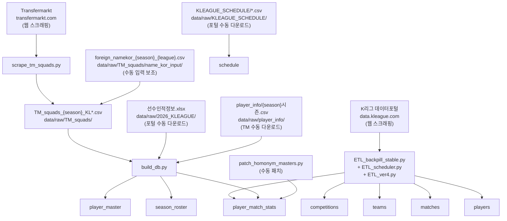

# Data Lineage

데이터의 원천(Source) → 수집/가공(Script) → 적재(Table) 흐름을 정리합니다.
새 파이프라인 설계, 특정 데이터 출처 추적, 장애 원인 파악 시 참조하세요.

---

## 전체 흐름도



---

## 테이블별 계보

| 테이블 | 원천 데이터 | 원천 유형 | 수집 스크립트 | 적재 스크립트 | 비고 |
|--------|-----------|---------|-------------|-------------|------|
| `competitions` | K리그 데이터포털 | 웹 스크래핑 | `ETL_backpill_stable.py` | `ETL_ver4.py` | |
| `teams` | K리그 데이터포털 | 웹 스크래핑 | `ETL_backpill_stable.py` | `ETL_ver4.py` | `build_db.py`에서도 TM팀명으로 보완 |
| `matches` | K리그 데이터포털 | 웹 스크래핑 | `ETL_backpill_stable.py` | `ETL_ver4.py` | `match_date` 전건 NULL — 별도 백필 필요 |
| `players` | K리그 데이터포털 | 웹 스크래핑 | `ETL_backpill_stable.py` | `ETL_ver4.py` | 레거시 보조 테이블 |
| `player_match_stats` | K리그 데이터포털 | 웹 스크래핑 | `ETL_backpill_stable.py` | `ETL_ver4.py` | `master_id`는 `build_db.py` + `patch_homonym_masters.py`로 백필 |
| `player_master` | TM_squads CSV + 선수인적정보.xlsx + player_info CSV | 스크래핑+로컬 | `scrape_tm_squads.py` (TM) / 수동 다운로드 | `build_db.py` | Phase 1a→1b→1b_ext 순차 갱신 |
| `season_roster` | TM_squads CSV | 스크래핑 | `scrape_tm_squads.py` | `build_db.py` Phase 2 | 동명이인 disambiguation 용도 |
| `schedule` | KLEAGUE_SCHEDULE/*.csv | 로컬 | 수동 다운로드 | 미정 | 2026시즌만 적재. `matches.match_date` 백필 소스 |

---

## 원천 데이터 목록

### 스크래핑으로 자동 수집

| 파일/경로 | 원천 사이트 | 수집 스크립트 | 적재 대상 |
|-----------|-----------|-------------|---------|
| `data/raw/TM_squads/TM_squads_{season}_KL*.csv` | transfermarkt.com | `scrape_tm_squads.py` | `player_master`, `season_roster` |

### 수동 다운로드 (로컬)

| 파일/경로 | 출처 | 적재 스크립트 | 적재 대상 | 비고 |
|-----------|-----|-------------|---------|------|
| `data/raw/2026_KLEAGUE/선수인적정보.xlsx` | K리그 데이터포털 | `build_db.py` Phase 1b | `player_master.name_kor` 갱신 | 2026 등록 선수 전원 |
| `data/raw/player_info/{season}시즌.csv` | transfermarkt.com | `build_db.py` Phase 1b | `player_master.name_kor` 갱신 | 2024·2025·2026 |
| `data/raw/KLEAGUE_SCHEDULE/kleague1_2024.csv` | K리그 데이터포털 | 미정 | `schedule` | 2024 KL1 일정 |
| `data/raw/KLEAGUE_SCHEDULE/kleague2_2024.csv` | K리그 데이터포털 | 미정 | `schedule` | 2024 KL2 일정 |
| `data/raw/KLEAGUE_SCHEDULE/kleague2_2025.csv` | K리그 데이터포털 | 미정 | `schedule` | 2025 KL2 일정 |
| `data/raw/KLEAGUE_SCHEDULE/kleague1_2026.csv` | K리그 데이터포털 | 미정 | `schedule` | 2026 KL1 일정 (중복 — 2026_KLEAGUE/2026_일정표.csv와 동일 내용 확인 필요) |
| `data/raw/2026_KLEAGUE/2026_일정표.csv` | K리그 데이터포털 | 현재 미적재 | `schedule` | 2026 KL1 일정 (현행 schedule 적재 소스와 다를 수 있음) |

### 수동 입력 보조 파일

| 파일/경로 | 용도 | 처리 방법 | 최종 적재 대상 |
|-----------|-----|---------|-------------|
| `data/raw/TM_squads/name_kor_input/foreign_namekor_{season}_{league}.csv` | 외국인 선수 포털 등록명 수기 입력 | `TM_squads_*.csv`의 `name_kor` 컬럼에 병합 | `player_master.name_kor` |

---

## 실행 순서 (전체 파이프라인)

```
1. [경기기록 수집]
   ETL_scheduler.py
   → competitions, teams, matches, players, player_match_stats 적재

2. [TM 스쿼드 수집]
   scrape_tm_squads.py --season {year} --league all
   → data/raw/TM_squads/TM_squads_{season}_KL*.csv 생성

3. [외국인 선수 한글명 입력]
   name_kor_input/ CSV에 수동 입력
   → TM_squads_*.csv name_kor 컬럼에 병합

4. [선수 원장 재구축]
   build_db.py
   → player_master, season_roster 재구축
   → player_match_stats.master_id 백필

5. [동명이인 패치]
   patch_homonym_masters.py
   → player_match_stats.master_id 수동 UPDATE

6. [일정 백필] (미구현)
   KLEAGUE_SCHEDULE/*.csv → schedule 적재
   → matches.match_date UPDATE
```

---

*최종 업데이트: 2026-04-19*
