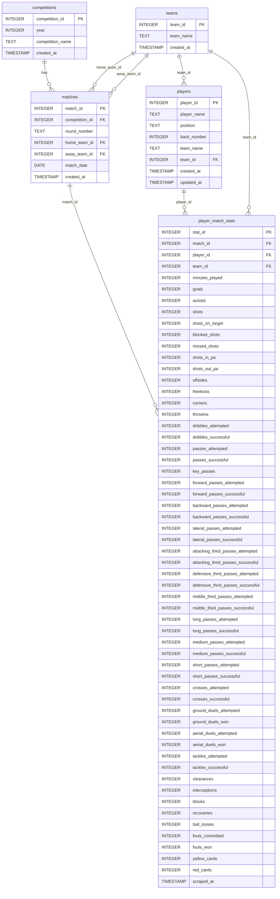

# Database Schema: kleague1.db

## ERD (Mermaid)

---

## 테이블 설명

### `competitions` — 대회 정보
| 컬럼 | 타입 | 설명 |
|---|---|---|
| competition_id | INTEGER PK | 자동 증가 |
| year | INTEGER | 시즌 연도 (예: 2025) |
| competition_name | TEXT | 대회명 (예: K리그1) |

UNIQUE: `(year, competition_name)`

---

### `teams` — 팀 정보
| 컬럼 | 타입 | 설명 |
|---|---|---|
| team_id | INTEGER PK | 자동 증가 |
| team_name | TEXT | 팀명 (예: 울산) |

UNIQUE: `(team_name)`

---

### `matches` — 경기 정보
| 컬럼 | 타입 | 설명 |
|---|---|---|
| match_id | INTEGER PK | 자동 증가 |
| competition_id | INTEGER FK | → competitions |
| round_number | TEXT | 라운드 (예: 1R, 34R) |
| home_team_id | INTEGER FK | → teams (홈팀) |
| away_team_id | INTEGER FK | → teams (어웨이팀) |
| match_date | DATE | 경기 날짜 (미수집 시 NULL) |

UNIQUE: `(competition_id, round_number, home_team_id, away_team_id)`

> **홈/어웨이 판정 기준**: 포털 `경기명` 컬럼의 `(H)`/`(A)` suffix
> - `(H)` = 해당 행의 팀이 홈 → `home_team_id = team_id`
> - `(A)` = 해당 행의 팀이 어웨이 → `away_team_id = team_id`

---

### `players` — 선수 정보
| 컬럼 | 타입 | 설명 |
|---|---|---|
| player_id | INTEGER PK | 자동 증가 |
| player_name | TEXT | 선수명 |
| position | TEXT | 포지션 |
| back_number | INTEGER | 등번호 |
| team_name | TEXT | 참고용 소속팀명 (TEXT) |
| team_id | INTEGER FK | → teams |

UNIQUE: `(player_name, back_number)`

> **설계 의도**: 이적 선수는 등번호를 유지하는 경우가 많아 `(player_name, back_number)`로 동일인 식별.
> 동명이인은 등번호가 다르므로 별도 `player_id`로 구분.

---

### `player_match_stats` — 선수 경기별 스탯
| 컬럼 | 타입 | 설명 |
|---|---|---|
| stat_id | INTEGER PK | 자동 증가 |
| match_id | INTEGER FK | → matches |
| player_id | INTEGER FK | → players |
| team_id | INTEGER FK | → teams (해당 경기 소속팀) |
| minutes_played | INTEGER | 출전 시간(분) |
| goals | INTEGER | 득점 |
| assists | INTEGER | 도움 |
| shots | INTEGER | 슈팅 |
| shots_on_target | INTEGER | 유효슈팅 |
| blocked_shots | INTEGER | 차단된 슈팅 |
| missed_shots | INTEGER | 벗어난 슈팅 |
| shots_in_pa | INTEGER | PA내 슈팅 |
| shots_out_pa | INTEGER | PA외 슈팅 |
| offsides | INTEGER | 오프사이드 |
| freekicks | INTEGER | 프리킥 |
| corners | INTEGER | 코너킥 |
| throwins | INTEGER | 스로인 |
| dribbles_attempted | INTEGER | 드리블 시도 |
| dribbles_successful | INTEGER | 드리블 성공 |
| passes_attempted | INTEGER | 패스 시도 |
| passes_successful | INTEGER | 패스 성공 |
| key_passes | INTEGER | 키패스 |
| forward_passes_attempted | INTEGER | 전방 패스 시도 |
| forward_passes_successful | INTEGER | 전방 패스 성공 |
| backward_passes_attempted | INTEGER | 후방 패스 시도 |
| backward_passes_successful | INTEGER | 후방 패스 성공 |
| lateral_passes_attempted | INTEGER | 횡패스 시도 |
| lateral_passes_successful | INTEGER | 횡패스 성공 |
| attacking_third_passes_attempted | INTEGER | 공격지역 패스 시도 |
| attacking_third_passes_successful | INTEGER | 공격지역 패스 성공 |
| defensive_third_passes_attempted | INTEGER | 수비지역 패스 시도 |
| defensive_third_passes_successful | INTEGER | 수비지역 패스 성공 |
| middle_third_passes_attempted | INTEGER | 중앙지역 패스 시도 |
| middle_third_passes_successful | INTEGER | 중앙지역 패스 성공 |
| long_passes_attempted | INTEGER | 롱패스 시도 |
| long_passes_successful | INTEGER | 롱패스 성공 |
| medium_passes_attempted | INTEGER | 중거리패스 시도 |
| medium_passes_successful | INTEGER | 중거리패스 성공 |
| short_passes_attempted | INTEGER | 숏패스 시도 |
| short_passes_successful | INTEGER | 숏패스 성공 |
| crosses_attempted | INTEGER | 크로스 시도 |
| crosses_successful | INTEGER | 크로스 성공 |
| ground_duels_attempted | INTEGER | 지상 경합 시도 |
| ground_duels_won | INTEGER | 지상 경합 성공 |
| aerial_duels_attempted | INTEGER | 공중 경합 시도 |
| aerial_duels_won | INTEGER | 공중 경합 성공 |
| tackles_attempted | INTEGER | 태클 시도 |
| tackles_successful | INTEGER | 태클 성공 |
| clearances | INTEGER | 클리어링 |
| interceptions | INTEGER | 인터셉트 |
| blocks | INTEGER | 차단 |
| recoveries | INTEGER | 볼 획득 |
| ball_losses | INTEGER | 볼 미스 |
| fouls_committed | INTEGER | 파울 |
| fouls_won | INTEGER | 피파울 |
| yellow_cards | INTEGER | 경고 |
| red_cards | INTEGER | 퇴장 |

UNIQUE: `(match_id, player_id)` — INSERT OR REPLACE 방식으로 중복 방지

---

## 현재 적재 현황 (2026-03-02 기준)

| 테이블 | 건수 |
|---|---|
| competitions | 1 (2025 K리그1) |
| teams | 12 |
| matches | 198 (33라운드 × 6경기) |
| players | 454 |
| player_match_stats | 7,919 |

**데이터 소스**: 2025 K리그1 1R~33R (CSV 적재)
