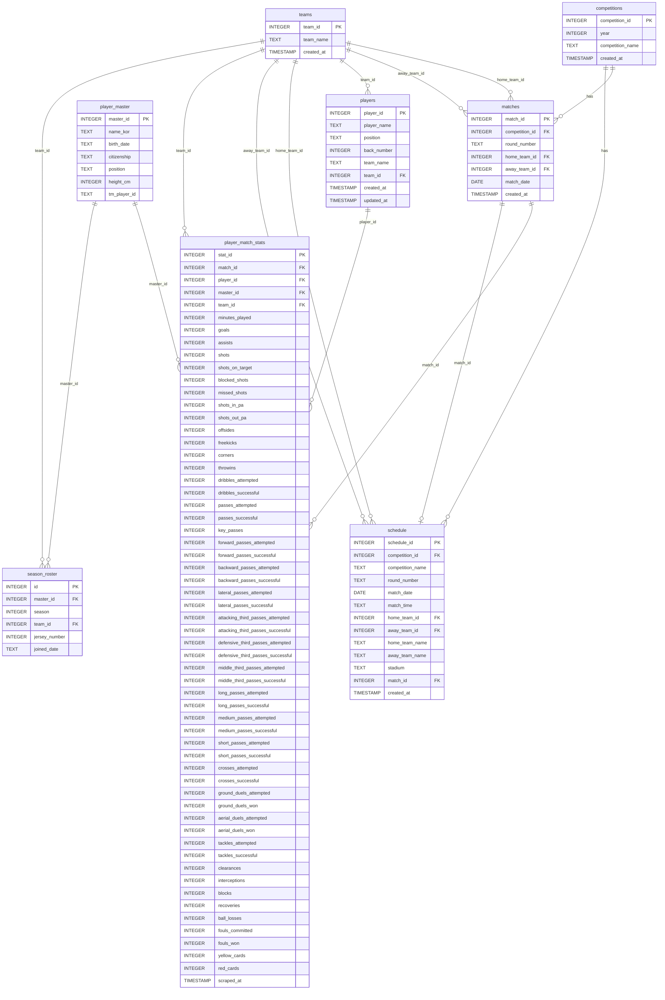

# Database Schema: kleague.db

## ERD (Mermaid)


```mermaid
erDiagram
    competitions {
        INTEGER competition_id PK
        INTEGER year
        TEXT    competition_name
        TIMESTAMP created_at
    }

    teams {
        INTEGER team_id PK
        TEXT    team_name
        TIMESTAMP created_at
    }

    matches {
        INTEGER match_id PK
        INTEGER competition_id FK
        TEXT    round_number
        INTEGER home_team_id FK
        INTEGER away_team_id FK
        DATE    match_date
        TIMESTAMP created_at
    }

    player_master {
        INTEGER master_id PK
        TEXT    name_kor
        TEXT    birth_date
        TEXT    citizenship
        TEXT    position
        INTEGER height_cm
        TEXT    tm_player_id
    }

    players {
        INTEGER player_id PK
        TEXT    player_name
        TEXT    position
        INTEGER back_number
        TEXT    team_name
        INTEGER team_id FK
        TIMESTAMP created_at
        TIMESTAMP updated_at
    }

    season_roster {
        INTEGER id PK
        INTEGER master_id FK
        INTEGER season
        INTEGER team_id FK
        INTEGER jersey_number
        TEXT    joined_date
    }

    player_match_stats {
        INTEGER stat_id PK
        INTEGER match_id FK
        INTEGER player_id FK
        INTEGER master_id FK
        INTEGER team_id FK
        INTEGER minutes_played
        INTEGER goals
        INTEGER assists
        INTEGER shots
        INTEGER shots_on_target
        INTEGER blocked_shots
        INTEGER missed_shots
        INTEGER shots_in_pa
        INTEGER shots_out_pa
        INTEGER offsides
        INTEGER freekicks
        INTEGER corners
        INTEGER throwins
        INTEGER dribbles_attempted
        INTEGER dribbles_successful
        INTEGER passes_attempted
        INTEGER passes_successful
        INTEGER key_passes
        INTEGER forward_passes_attempted
        INTEGER forward_passes_successful
        INTEGER backward_passes_attempted
        INTEGER backward_passes_successful
        INTEGER lateral_passes_attempted
        INTEGER lateral_passes_successful
        INTEGER attacking_third_passes_attempted
        INTEGER attacking_third_passes_successful
        INTEGER defensive_third_passes_attempted
        INTEGER defensive_third_passes_successful
        INTEGER middle_third_passes_attempted
        INTEGER middle_third_passes_successful
        INTEGER long_passes_attempted
        INTEGER long_passes_successful
        INTEGER medium_passes_attempted
        INTEGER medium_passes_successful
        INTEGER short_passes_attempted
        INTEGER short_passes_successful
        INTEGER crosses_attempted
        INTEGER crosses_successful
        INTEGER ground_duels_attempted
        INTEGER ground_duels_won
        INTEGER aerial_duels_attempted
        INTEGER aerial_duels_won
        INTEGER tackles_attempted
        INTEGER tackles_successful
        INTEGER clearances
        INTEGER interceptions
        INTEGER blocks
        INTEGER recoveries
        INTEGER ball_losses
        INTEGER fouls_committed
        INTEGER fouls_won
        INTEGER yellow_cards
        INTEGER red_cards
        TIMESTAMP scraped_at
    }

    schedule {
        INTEGER schedule_id PK
        INTEGER competition_id FK
        TEXT    competition_name
        TEXT    round_number
        DATE    match_date
        TEXT    match_time
        INTEGER home_team_id FK
        INTEGER away_team_id FK
        TEXT    home_team_name
        TEXT    away_team_name
        TEXT    stadium
        INTEGER match_id FK
        TIMESTAMP created_at
    }

    competitions ||--o{ matches : "has"
    competitions ||--o{ schedule : "has"
    teams ||--o{ matches : "home_team_id"
    teams ||--o{ matches : "away_team_id"
    teams ||--o{ players : "team_id"
    teams ||--o{ schedule : "home_team_id"
    teams ||--o{ schedule : "away_team_id"
    matches ||--o{ player_match_stats : "match_id"
    matches ||--o| schedule : "match_id"
    players ||--o{ player_match_stats : "player_id"
    teams ||--o{ player_match_stats : "team_id"
    player_master ||--o{ player_match_stats : "master_id"
    player_master ||--o{ season_roster : "master_id"
    teams ||--o{ season_roster : "team_id"
```

---

## 테이블 설명

### `competitions` — 대회 정보
| 컬럼 | 타입 | 설명 |
|---|---|---|
| competition_id | INTEGER PK | 자동 증가 |
| year | INTEGER | 시즌 연도 (예: 2025) |
| competition_name | TEXT | 대회명 (예: K리그1) |

UNIQUE: `(year, competition_name)`

---

### `teams` — 팀 정보
| 컬럼 | 타입 | 설명 |
|---|---|---|
| team_id | INTEGER PK | 자동 증가 |
| team_name | TEXT | 팀명 (예: 울산) |

UNIQUE: `(team_name)`

---

### `matches` — 경기 정보
| 컬럼 | 타입 | 설명 |
|---|---|---|
| match_id | INTEGER PK | 자동 증가 |
| competition_id | INTEGER FK | → competitions |
| round_number | TEXT | 라운드 (예: 1R, 34R) |
| home_team_id | INTEGER FK | → teams (홈팀) |
| away_team_id | INTEGER FK | → teams (어웨이팀) |
| match_date | DATE | 경기 날짜 (미수집 시 NULL) |

UNIQUE: `(competition_id, round_number, home_team_id, away_team_id)`

> **홈/어웨이 판정 기준**: 포털 `경기명` 컬럼의 `(H)`/`(A)` suffix
> - `(H)` = 해당 행의 팀이 홈 → `home_team_id = team_id`
> - `(A)` = 해당 행의 팀이 어웨이 → `away_team_id = team_id`

---

### `player_master` — 선수 인물 원장
| 컬럼 | 타입 | 설명 |
|---|---|---|
| master_id | INTEGER PK | 자동 증가 |
| name_kor | TEXT NOT NULL | 한글명 (한국인) 또는 한글 음차명 (외국인) |
| birth_date | TEXT | 생년월일 (YYYY-MM-DD) — NULL 없음 |
| citizenship | TEXT | 국적 (TM 표기) |
| position | TEXT | 포지션 대분류 (Attack / Midfield / Defender / Goalkeeper) |
| height_cm | INTEGER | 키 (cm) |
| tm_player_id | TEXT | Transfermarkt 선수 고유 ID |

UNIQUE: `(name_kor, birth_date)`

> **설계 의도**: 1인 = 1행. ETL 매핑 키 = `name_kor`. 동명이인 구분 키 = `birth_date` + `season_roster(team_id)`.
> `build_db.py`로 재구축. 소스: `TM_squads/TM_squads_*.csv`(name_kor 컬럼) + `선수인적정보.xlsx` + `players` 테이블.
> **적재 현황 (2026-04-19)**: 총 1,650명 / birth_date NULL 0명

---

### `players` — 선수 정보 (스크래핑 누적 로스터, 레거시)
| 컬럼 | 타입 | 설명 |
|---|---|---|
| player_id | INTEGER PK | 자동 증가 |
| player_name | TEXT | 선수명 (한글) |
| position | TEXT | 포지션 |
| back_number | INTEGER | 등번호 (스크래핑 시점 기준) |
| team_name | TEXT | 스크래핑 시점 소속팀명 (참고용) |
| team_id | INTEGER FK | → teams (스크래핑 시점 소속팀) |

UNIQUE: `(player_name, back_number)`

> **주의**: v0.7.0부터 `master_id` 컬럼 제거. `player_match_stats` 조회 시 `master_id` 컬럼 직접 사용 권장.
> `team_name`, `team_id`는 스크래핑 시점 단일값이므로 시즌별 소속팀 조회에는 `season_roster` 사용.
> 이 테이블은 `build_db.py Phase 3` 백필을 위한 보조 테이블로 유지됨 (삭제 예정 없음).

---

### `season_roster` — 시즌별 선수-팀 스냅샷
| 컬럼 | 타입 | 설명 |
|---|---|---|
| id | INTEGER PK | 자동 증가 |
| master_id | INTEGER FK | → player_master |
| season | INTEGER | 시즌 연도 (2024, 2025, …) |
| team_id | INTEGER FK | → teams |
| jersey_number | INTEGER | 등번호 (NULL 허용 — TM 미등록 선수) |
| joined_date | TEXT | 합류일 (TM 데이터) |

UNIQUE: `(master_id, season, team_id)` — jersey_number는 UNIQUE 아님 (여름 이적시장 재배정 가능)

> **소스**: `data/raw/TM_squads/TM_squads_{season}_KL*.csv` → `build_db.py Phase 2`.
> **역할**: ETL 동명이인 disambiguation (1차: name_kor, 2차: season_roster team_id 필터).
> **적재 현황 (2026-04-19)**: 3,137건
> **시즌별 소속팀 조회 쿼리 패턴**:
> ```sql
> SELECT pm.name_kor, pm.birth_date, sr.season, t.team_name
> FROM season_roster sr
> JOIN player_master pm ON sr.master_id = pm.master_id
> JOIN teams t          ON sr.team_id = t.team_id
> WHERE pm.name_kor = '문선민'
> ORDER BY sr.season
> ```

---

### `player_match_stats` — 선수 경기별 스탯
| 컬럼 | 타입 | 설명 |
|---|---|---|
| stat_id | INTEGER PK | 자동 증가 |
| match_id | INTEGER FK | → matches |
| player_id | INTEGER FK | → players (레거시, 유지) |
| master_id | INTEGER FK | → player_master (v0.7.0 추가, 99% 확보) |
| team_id | INTEGER FK | → teams (해당 경기 소속팀) |
| minutes_played | INTEGER | 출전 시간(분) |
| goals | INTEGER | 득점 |
| assists | INTEGER | 도움 |
| shots | INTEGER | 슈팅 |
| shots_on_target | INTEGER | 유효슈팅 |
| blocked_shots | INTEGER | 차단된 슈팅 |
| missed_shots | INTEGER | 벗어난 슈팅 |
| shots_in_pa | INTEGER | PA내 슈팅 |
| shots_out_pa | INTEGER | PA외 슈팅 |
| offsides | INTEGER | 오프사이드 |
| freekicks | INTEGER | 프리킥 |
| corners | INTEGER | 코너킥 |
| throwins | INTEGER | 스로인 |
| dribbles_attempted | INTEGER | 드리블 시도 |
| dribbles_successful | INTEGER | 드리블 성공 |
| passes_attempted | INTEGER | 패스 시도 |
| passes_successful | INTEGER | 패스 성공 |
| key_passes | INTEGER | 키패스 |
| forward_passes_attempted | INTEGER | 전방 패스 시도 |
| forward_passes_successful | INTEGER | 전방 패스 성공 |
| backward_passes_attempted | INTEGER | 후방 패스 시도 |
| backward_passes_successful | INTEGER | 후방 패스 성공 |
| lateral_passes_attempted | INTEGER | 횡패스 시도 |
| lateral_passes_successful | INTEGER | 횡패스 성공 |
| attacking_third_passes_attempted | INTEGER | 공격지역 패스 시도 |
| attacking_third_passes_successful | INTEGER | 공격지역 패스 성공 |
| defensive_third_passes_attempted | INTEGER | 수비지역 패스 시도 |
| defensive_third_passes_successful | INTEGER | 수비지역 패스 성공 |
| middle_third_passes_attempted | INTEGER | 중앙지역 패스 시도 |
| middle_third_passes_successful | INTEGER | 중앙지역 패스 성공 |
| long_passes_attempted | INTEGER | 롱패스 시도 |
| long_passes_successful | INTEGER | 롱패스 성공 |
| medium_passes_attempted | INTEGER | 중거리패스 시도 |
| medium_passes_successful | INTEGER | 중거리패스 성공 |
| short_passes_attempted | INTEGER | 숏패스 시도 |
| short_passes_successful | INTEGER | 숏패스 성공 |
| crosses_attempted | INTEGER | 크로스 시도 |
| crosses_successful | INTEGER | 크로스 성공 |
| ground_duels_attempted | INTEGER | 지상 경합 시도 |
| ground_duels_won | INTEGER | 지상 경합 성공 |
| aerial_duels_attempted | INTEGER | 공중 경합 시도 |
| aerial_duels_won | INTEGER | 공중 경합 성공 |
| tackles_attempted | INTEGER | 태클 시도 |
| tackles_successful | INTEGER | 태클 성공 |
| clearances | INTEGER | 클리어링 |
| interceptions | INTEGER | 인터셉트 |
| blocks | INTEGER | 차단 |
| recoveries | INTEGER | 볼 획득 |
| ball_losses | INTEGER | 볼 미스 |
| fouls_committed | INTEGER | 파울 |
| fouls_won | INTEGER | 피파울 |
| yellow_cards | INTEGER | 경고 |
| red_cards | INTEGER | 퇴장 |

UNIQUE: `(match_id, player_id)` — INSERT OR REPLACE 방식으로 중복 방지

> **권장 쿼리 패턴** (v0.7.0~): `master_id` 직접 조인으로 `players` 테이블 우회
> ```sql
> SELECT pm.name_kor, pm.birth_date, t.team_name, m.round_number, pms.goals, pms.assists
> FROM player_match_stats pms
> JOIN player_master pm ON pms.master_id = pm.master_id
> JOIN teams t ON pms.team_id = t.team_id
> JOIN matches m ON pms.match_id = m.match_id
> JOIN competitions c ON m.competition_id = c.competition_id
> WHERE pm.name_kor = '문선민' AND c.year = 2024
> ```

---

### `schedule` — 시즌 일정 마스터
| 컬럼 | 타입 | 설명 |
|---|---|---|
| schedule_id | INTEGER PK | 자동 증가 |
| competition_id | INTEGER FK | → competitions |
| competition_name | TEXT | 대회명 (CSV 원본값: K리그1, K리그2, K리그 슈퍼컵) |
| round_number | TEXT | 라운드 (예: 1R, 슈퍼컵) |
| match_date | DATE | 경기 날짜 |
| match_time | TEXT | 경기 시작 시간 |
| home_team_id | INTEGER FK | → teams (홈팀) |
| away_team_id | INTEGER FK | → teams (어웨이팀) |
| home_team_name | TEXT | 홈팀명 (CSV 원본값) |
| away_team_name | TEXT | 어웨이팀명 (CSV 원본값) |
| stadium | TEXT | 경기장 |
| match_id | INTEGER FK | → matches (경기 결과 ETL 후 연결) |

UNIQUE: `(competition_id, round_number, home_team_id, away_team_id)`

> **matches 테이블과 조인키**: `(competition_id, round_number, home_team_id, away_team_id)` — matches의 UNIQUE 제약과 동일하여 1:1 매핑 보장
> **match_id**: 경기 결과가 ETL로 적재된 후 UPDATE. NULL이면 아직 미진행 경기.

---

## 현재 적재 현황 (2026-04-19 기준)

| 테이블 | 건수 | 비고 |
|---|---|---|
| competitions | 6 | 2024·2025 K리그1, 2026 K리그1·K리그2·슈퍼컵·하나은행K리그1 |
| teams | 29+ | K리그1 13팀 + K리그2 16팀 |
| matches | 438+ | 2024·2025 K리그1 (각 38라운드) + 2026 K리그1 7라운드 (42경기) |
| players | 786+ | 레거시 테이블 — ETL 시 누적 (master_id 미매핑) |
| player_master | 1,650 | 2024·2025·2026 3시즌 누적 / birth_date 100% |
| season_roster | 3,137 | 2024 KL1+KL2 / 2025 KL1+KL2 / 2026 KL1+KL2 |
| player_match_stats | 30,310 | 2024·2025 K리그1 + 2024 K리그2 + **2026 K리그1 1R~15R** / master_id 17,429건+ |
| schedule | 471 | 2026 K리그1 198 / K리그2 272 / 슈퍼컵 1 |

**데이터 소스**
- 2024 K리그1: 포털 스크래핑 (`ETL_backpill_stable.py`)
- 2025 K리그1 1R~33R: CSV 적재 (`ETL_ver4.py`)
- 2025 K리그1 34R~38R: 포털 스크래핑 (`ETL_backpill_stable.py`, `from_round=34`)
- 2024 K리그2 전 시즌(1R~41R): 포털 스크래핑 (`ETL_scheduler.py --competition K리그2 --year 2024`, 2026-04-25)
- 2026 K리그1 1R~7R: 포털 스크래핑 (`ETL_scheduler.py --to-round 7`, 2026-04-19)
- 2026 K리그1 8R~15R: 포털 스크래핑 (`ETL_scheduler.py --from-round 8 --to-round 15`, 2026-05-11) — 포털 로그인 우회 적용
- 2026 일정: CSV 적재 (`data/raw/2026_KLEAGUE/2026_일정표.csv`)
- player_master + season_roster: `build_db.py` (v0.7.0)
