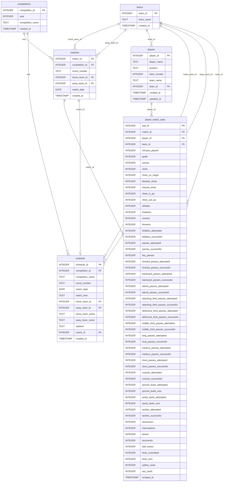

# Database Schema: kleague1.db

## ERD (Mermaid)

```mermaid
erDiagram
    competitions {
        INTEGER competition_id PK
        INTEGER year
        TEXT    competition_name
        TIMESTAMP created_at
    }

    teams {
        INTEGER team_id PK
        TEXT    team_name
        TIMESTAMP created_at
    }

    matches {
        INTEGER match_id PK
        INTEGER competition_id FK
        TEXT    round_number
        INTEGER home_team_id FK
        INTEGER away_team_id FK
        DATE    match_date
        TIMESTAMP created_at
    }

    players {
        INTEGER player_id PK
        TEXT    player_name
        TEXT    position
        INTEGER back_number
        TEXT    team_name
        INTEGER team_id FK
        TIMESTAMP created_at
        TIMESTAMP updated_at
    }

    player_match_stats {
        INTEGER stat_id PK
        INTEGER match_id FK
        INTEGER player_id FK
        INTEGER team_id FK
        INTEGER minutes_played
        INTEGER goals
        INTEGER assists
        INTEGER shots
        INTEGER shots_on_target
        INTEGER blocked_shots
        INTEGER missed_shots
        INTEGER shots_in_pa
        INTEGER shots_out_pa
        INTEGER offsides
        INTEGER freekicks
        INTEGER corners
        INTEGER throwins
        INTEGER dribbles_attempted
        INTEGER dribbles_successful
        INTEGER passes_attempted
        INTEGER passes_successful
        INTEGER key_passes
        INTEGER forward_passes_attempted
        INTEGER forward_passes_successful
        INTEGER backward_passes_attempted
        INTEGER backward_passes_successful
        INTEGER lateral_passes_attempted
        INTEGER lateral_passes_successful
        INTEGER attacking_third_passes_attempted
        INTEGER attacking_third_passes_successful
        INTEGER defensive_third_passes_attempted
        INTEGER defensive_third_passes_successful
        INTEGER middle_third_passes_attempted
        INTEGER middle_third_passes_successful
        INTEGER long_passes_attempted
        INTEGER long_passes_successful
        INTEGER medium_passes_attempted
        INTEGER medium_passes_successful
        INTEGER short_passes_attempted
        INTEGER short_passes_successful
        INTEGER crosses_attempted
        INTEGER crosses_successful
        INTEGER ground_duels_attempted
        INTEGER ground_duels_won
        INTEGER aerial_duels_attempted
        INTEGER aerial_duels_won
        INTEGER tackles_attempted
        INTEGER tackles_successful
        INTEGER clearances
        INTEGER interceptions
        INTEGER blocks
        INTEGER recoveries
        INTEGER ball_losses
        INTEGER fouls_committed
        INTEGER fouls_won
        INTEGER yellow_cards
        INTEGER red_cards
        TIMESTAMP scraped_at
    }

    schedule {
        INTEGER schedule_id PK
        INTEGER competition_id FK
        TEXT    competition_name
        TEXT    round_number
        DATE    match_date
        TEXT    match_time
        INTEGER home_team_id FK
        INTEGER away_team_id FK
        TEXT    home_team_name
        TEXT    away_team_name
        TEXT    stadium
        INTEGER match_id FK
        TIMESTAMP created_at
    }

    competitions ||--o{ matches : "has"
    competitions ||--o{ schedule : "has"
    teams ||--o{ matches : "home_team_id"
    teams ||--o{ matches : "away_team_id"
    teams ||--o{ players : "team_id"
    teams ||--o{ schedule : "home_team_id"
    teams ||--o{ schedule : "away_team_id"
    matches ||--o{ player_match_stats : "match_id"
    matches ||--o| schedule : "match_id"
    players ||--o{ player_match_stats : "player_id"
    teams ||--o{ player_match_stats : "team_id"
```

---

## 테이블 설명

### `competitions` — 대회 정보
| 컬럼 | 타입 | 설명 |
|---|---|---|
| competition_id | INTEGER PK | 자동 증가 |
| year | INTEGER | 시즌 연도 (예: 2025) |
| competition_name | TEXT | 대회명 (예: K리그1) |

UNIQUE: `(year, competition_name)`

---

### `teams` — 팀 정보
| 컬럼 | 타입 | 설명 |
|---|---|---|
| team_id | INTEGER PK | 자동 증가 |
| team_name | TEXT | 팀명 (예: 울산) |

UNIQUE: `(team_name)`

---

### `matches` — 경기 정보
| 컬럼 | 타입 | 설명 |
|---|---|---|
| match_id | INTEGER PK | 자동 증가 |
| competition_id | INTEGER FK | → competitions |
| round_number | TEXT | 라운드 (예: 1R, 34R) |
| home_team_id | INTEGER FK | → teams (홈팀) |
| away_team_id | INTEGER FK | → teams (어웨이팀) |
| match_date | DATE | 경기 날짜 (미수집 시 NULL) |

UNIQUE: `(competition_id, round_number, home_team_id, away_team_id)`

> **홈/어웨이 판정 기준**: 포털 `경기명` 컬럼의 `(H)`/`(A)` suffix
> - `(H)` = 해당 행의 팀이 홈 → `home_team_id = team_id`
> - `(A)` = 해당 행의 팀이 어웨이 → `away_team_id = team_id`

---

### `players` — 선수 정보
| 컬럼 | 타입 | 설명 |
|---|---|---|
| player_id | INTEGER PK | 자동 증가 |
| player_name | TEXT | 선수명 |
| position | TEXT | 포지션 |
| back_number | INTEGER | 등번호 |
| team_name | TEXT | 참고용 소속팀명 (TEXT) |
| team_id | INTEGER FK | → teams |

UNIQUE: `(player_name, back_number)`

> **설계 의도**: 이적 선수는 등번호를 유지하는 경우가 많아 `(player_name, back_number)`로 동일인 식별.
> 동명이인은 등번호가 다르므로 별도 `player_id`로 구분.

---

### `player_match_stats` — 선수 경기별 스탯
| 컬럼 | 타입 | 설명 |
|---|---|---|
| stat_id | INTEGER PK | 자동 증가 |
| match_id | INTEGER FK | → matches |
| player_id | INTEGER FK | → players |
| team_id | INTEGER FK | → teams (해당 경기 소속팀) |
| minutes_played | INTEGER | 출전 시간(분) |
| goals | INTEGER | 득점 |
| assists | INTEGER | 도움 |
| shots | INTEGER | 슈팅 |
| shots_on_target | INTEGER | 유효슈팅 |
| blocked_shots | INTEGER | 차단된 슈팅 |
| missed_shots | INTEGER | 벗어난 슈팅 |
| shots_in_pa | INTEGER | PA내 슈팅 |
| shots_out_pa | INTEGER | PA외 슈팅 |
| offsides | INTEGER | 오프사이드 |
| freekicks | INTEGER | 프리킥 |
| corners | INTEGER | 코너킥 |
| throwins | INTEGER | 스로인 |
| dribbles_attempted | INTEGER | 드리블 시도 |
| dribbles_successful | INTEGER | 드리블 성공 |
| passes_attempted | INTEGER | 패스 시도 |
| passes_successful | INTEGER | 패스 성공 |
| key_passes | INTEGER | 키패스 |
| forward_passes_attempted | INTEGER | 전방 패스 시도 |
| forward_passes_successful | INTEGER | 전방 패스 성공 |
| backward_passes_attempted | INTEGER | 후방 패스 시도 |
| backward_passes_successful | INTEGER | 후방 패스 성공 |
| lateral_passes_attempted | INTEGER | 횡패스 시도 |
| lateral_passes_successful | INTEGER | 횡패스 성공 |
| attacking_third_passes_attempted | INTEGER | 공격지역 패스 시도 |
| attacking_third_passes_successful | INTEGER | 공격지역 패스 성공 |
| defensive_third_passes_attempted | INTEGER | 수비지역 패스 시도 |
| defensive_third_passes_successful | INTEGER | 수비지역 패스 성공 |
| middle_third_passes_attempted | INTEGER | 중앙지역 패스 시도 |
| middle_third_passes_successful | INTEGER | 중앙지역 패스 성공 |
| long_passes_attempted | INTEGER | 롱패스 시도 |
| long_passes_successful | INTEGER | 롱패스 성공 |
| medium_passes_attempted | INTEGER | 중거리패스 시도 |
| medium_passes_successful | INTEGER | 중거리패스 성공 |
| short_passes_attempted | INTEGER | 숏패스 시도 |
| short_passes_successful | INTEGER | 숏패스 성공 |
| crosses_attempted | INTEGER | 크로스 시도 |
| crosses_successful | INTEGER | 크로스 성공 |
| ground_duels_attempted | INTEGER | 지상 경합 시도 |
| ground_duels_won | INTEGER | 지상 경합 성공 |
| aerial_duels_attempted | INTEGER | 공중 경합 시도 |
| aerial_duels_won | INTEGER | 공중 경합 성공 |
| tackles_attempted | INTEGER | 태클 시도 |
| tackles_successful | INTEGER | 태클 성공 |
| clearances | INTEGER | 클리어링 |
| interceptions | INTEGER | 인터셉트 |
| blocks | INTEGER | 차단 |
| recoveries | INTEGER | 볼 획득 |
| ball_losses | INTEGER | 볼 미스 |
| fouls_committed | INTEGER | 파울 |
| fouls_won | INTEGER | 피파울 |
| yellow_cards | INTEGER | 경고 |
| red_cards | INTEGER | 퇴장 |

UNIQUE: `(match_id, player_id)` — INSERT OR REPLACE 방식으로 중복 방지

---

### `schedule` — 시즌 일정 마스터
| 컬럼 | 타입 | 설명 |
|---|---|---|
| schedule_id | INTEGER PK | 자동 증가 |
| competition_id | INTEGER FK | → competitions |
| competition_name | TEXT | 대회명 (CSV 원본값: K리그1, K리그2, K리그 슈퍼컵) |
| round_number | TEXT | 라운드 (예: 1R, 슈퍼컵) |
| match_date | DATE | 경기 날짜 |
| match_time | TEXT | 경기 시작 시간 |
| home_team_id | INTEGER FK | → teams (홈팀) |
| away_team_id | INTEGER FK | → teams (어웨이팀) |
| home_team_name | TEXT | 홈팀명 (CSV 원본값) |
| away_team_name | TEXT | 어웨이팀명 (CSV 원본값) |
| stadium | TEXT | 경기장 |
| match_id | INTEGER FK | → matches (경기 결과 ETL 후 연결) |

UNIQUE: `(competition_id, round_number, home_team_id, away_team_id)`

> **matches 테이블과 조인키**: `(competition_id, round_number, home_team_id, away_team_id)` — matches의 UNIQUE 제약과 동일하여 1:1 매핑 보장
> **match_id**: 경기 결과가 ETL로 적재된 후 UPDATE. NULL이면 아직 미진행 경기.

---

## 현재 적재 현황 (2026-03-14 기준)

| 테이블 | 건수 | 비고 |
|---|---|---|
| competitions | 4 | 2024·2025 K리그1, 2026 K리그1·K리그2·슈퍼컵 |
| teams | 29 | K리그1 13팀 + K리그2 16팀 |
| matches | 396 | 2024·2025 K리그1 (각 33라운드 × 6경기) |
| players | ~900 | 2024·2025 K리그1 선수 |
| player_match_stats | ~15,000 | 2024·2025 K리그1 경기별 스탯 |
| schedule | 471 | 2026 K리그1 198 / K리그2 272 / 슈퍼컵 1 |

**데이터 소스**
- 2024 K리그1: 포털 스크래핑 (`ETL_backpill_stable.py`)
- 2025 K리그1 1R~33R: CSV 적재 (`ETL_ver4.py`)
- 2025 K리그1 34R~38R: 포털 스크래핑 (`ETL_backpill_stable.py`, `from_round=34`)
- 2026 일정: CSV 적재 (`data/raw/2026_KLEAGUE/2026_일정표.csv`)
